# Fluxograma — plugin `Titan`

Plugin com **sete skills**. Cada uma é uma **porta de entrada independente** — você pode começar
por qualquer uma:

- **🧠 /planejar** — desenha um produto/software do zero, **descobre como o problema já foi resolvido lá fora** e **audita a planta** antes de construir.
- **📝 /spec-plan** — você traz um **plano/decisão/ideia**; ele **grelha até o entendimento comum** e escreve uma **spec congelada** pronta pra construir com IA. No fim, oferece mandar pra `/gpt-builder`.
- **🔬 /auto-think** — você traz um **problema sem resposta**; ele **estuda a fundo** (vários ângulos em paralelo, confronta os achados com o Codex/GPT) e entrega **opções com veredito**. Gera caminhos — não executa, para na recomendação.
- **⚙️ /gpt-builder** — recebe uma **spec congelada** e executa: o **Codex constrói** (mão na massa, acesso total), o **Claude lê o diff inteiro** e um **fiscal independente** prova cada item; **você assina** antes de qualquer commit.
- **🔎 /search** — **pesquisa profunda via Exa com procedência**: cada número volta com a página, a frase e a data em que foi lido. Alimenta os outros ou roda sozinha.
- **🪢 /handoff** — salva o ponto exato do trabalho e passa o bastão pra outra sessão.
- **🛡️ /gpt-optimizer** — **segunda opinião adversarial pra refletir antes de cravar**, no meio de qualquer conversa: sem precisar de plano nem código formal, ele monta o alvo sozinho, o Codex tenta derrubar, e devolve veredito **Seguir / Ajustar / Bloquear**.

Elas também formam **um ciclo**: a spec sai do `planejar` (a planta), do `spec-plan` (grelhada) ou
a solução escolhida sai do `auto-think`, e vai pro `gpt-builder` pra ser construída; se o trabalho
fica longo e o contexto enche, você chama o `handoff` e numa sessão nova retoma de onde parou.

> A grande diferença que costuma confundir: **`planejar` revisa o PLANO** (a planta, antes de
> existir código) e **`gpt-builder` revisa o que o CODEX CONSTRUIU** (a casa pronta, feita por
> outro par de mãos). Não é a mesma conferência duas vezes — são dois momentos diferentes.
>
> E entre os "pensadores": **`planejar` parte de uma IDEIA de produto** (desenha algo novo);
> **`spec-plan` parte de um PLANO/DECISÃO** (grelha até virar spec); **`auto-think` parte de um
> PROBLEMA sem resposta** (investiga e recomenda opções). Os três alimentam o `gpt-builder`.
>
> Já o **`gpt-optimizer`** parte de uma **decisão que você JÁ tomou** — não gera opções, **testa a que você
> escolheu** (o GPT tenta derrubar). É o **confronto avulso**, fora do ciclo, que você chama a
> qualquer momento — o mesmo motor de confronto Codex que o `planejar` e o `auto-think` usam por dentro.

```mermaid
%%{init: {'theme':'base', 'themeVariables': {
  'fontSize':'15px',
  'fontFamily':'Helvetica, Arial, sans-serif',
  'lineColor':'#1f6b4f',
  'edgeLabelBackground':'#ffffff'
}}}%%
flowchart TD
    START(["💡 Você chega com algo pra fazer"])
    PORTAS{"VOCÊ escolhe por onde começar<br/>as portas são independentes"}
    START --> PORTAS

    subgraph PORTASROW[" "]
        direction LR
        E1(["🧠 ideia de produto<br/>quero CONSTRUIR do zero"])
        E2(["📝 plano/decisão<br/>quero virar uma SPEC"])
        E3(["🔬 problema sem resposta<br/>quero ESTUDAR e ver opções"])
        E4(["⚙️ já tenho a SPEC<br/>quero CONSTRUIR até o fim"])
        E5(["🔎 preciso PESQUISAR<br/>com fonte de cada número"])
        E6(["🪢 recomeçar sessão<br/>reduzir contexto"])
        E7(["🛡️ já decidi algo<br/>quero TESTAR antes de cravar"])
        E1 ~~~ E2 ~~~ E3 ~~~ E4 ~~~ E5 ~~~ E6 ~~~ E7
    end
    PORTAS --> E1 & E2 & E3 & E4 & E5 & E6 & E7
    E1 --> PINTRO
    E2 --> SINTRO
    E3 --> TINTRO
    E4 --> AINTRO
    E5 --> SEINTRO
    E6 --> HINTRO
    E7 --> GINTRO

    %% ───────── PLANEJAR ─────────
    subgraph THINKERS[" "]
        direction LR
        subgraph PLANEJAR[" "]
            direction TB
            PINTRO["<b>🧠 /planejar</b> — desenha o produto e <b>audita a planta</b> (antes de construir)<br/>você aprova entre quase todas as fases (7→8 segue direto)"]
            P0["<b>Fase 0 · Preflight</b><br/><i>confere as ferramentas que vai precisar</i>"]
            P1["<b>1 · Brainstorm</b><br/><i>define o problema e o escopo do MVP</i>"]
            P1B["<b>1b · Como já resolveram isso</b> (prior art)<br/><i>busca soluções existentes, peneira pela sua realidade · recomendada, pulável</i>"]
            P2["<b>2 · Discovery</b><br/><i>entende cliente, marca e mercado</i>"]
            P3["<b>3 · Pesquisa técnica</b><br/><i>escolhe a stack com dados, não achismo</i>"]
            P4["<b>4 · Design</b><br/><i>estilo, mockups e documento visual</i>"]
            P5["<b>5 · Escreve o plano</b><br/><i>passos miúdos com o código já pronto</i>"]
            P6["<b>6 · Auditoria do PLANO</b><br/><i>especialistas + <b>Codex GPT</b> revisam a planta</i>"]
            P7["<b>7 · Correção</b><br/><i>aplica no plano tudo que a auditoria achou</i>"]
            P8["<b>8 · Montagem</b><br/><i>plano final, limpo, pronto pra executar</i>"]
            PINTRO --> P0 --> P1 --> P1B --> P2 --> P3 --> P4 --> P5 --> P6 --> P7 --> P8
        end
        subgraph SPECPLAN[" "]
            direction TB
            SINTRO["<b>📝 /spec-plan</b> — grelha um plano/decisão/ideia e escreve uma <b>spec congelada</b> pra construir com IA<br/>duas fases, em ordem · não implementa nada"]
            S1["<b>Fase 1 · Investiga</b><br/><i>grelha em rodadas até o entendimento comum · fato se confere (subagente), decisão é sua · não avança sem seu aceite</i>"]
            S2["<b>Fase 2 · Escreve a spec</b><br/><i>problema, solução, user stories, cenários de comportamento (given/when/then), decisões · NÃO reabre o que já fechou</i>"]
            SINTRO --> S1 --> S2
        end
        subgraph AUTOTHINK[" "]
            direction TB
            TINTRO["<b>🔬 /auto-think</b> — você traz um PROBLEMA sem resposta; ele estuda a fundo e <b>entrega opções com veredito</b> (não executa)<br/>sempre fundo · gera caminhos, não testa um já escolhido (isso é o gpt-optimizer)"]
            T1["<b>1 · Espelha o pedido e confirma o alvo</b><br/><i>problema, ideia ou decisão? confirma antes de gastar o estudo · depois separa fato de suposição</i>"]
            T2["<b>2 · Estuda vários ângulos EM PARALELO</b><br/><i>técnico · simplicidade · custo/risco · precedente · contexto interno</i><br/><i>se é de uma tecnologia com dono → puxa a <b>doc oficial</b> + sua <b>skill instalada</b></i>"]
            T3["<b>3 · Codex GPT confronta</b> — 1ª rodada<br/><i>tenta DERRUBAR cada candidata</i>"]
            TQ["<b>4 · Portão de qualidade</b> — 4 perguntas que toda candidata passa<br/><i>resolve a doença ou só o sintoma? · funciona com prova colada? · sobra incerteza que muda a decisão? · ou é lixo (fonte fraca/sem lastro)?</i>"]
            T4["<b>5 · Re-cava o que ficou aberto</b><br/><i>só dúvida que muda a decisão · teto duro contra espiral</i>"]
            T5["<b>6 · Codex GPT confronta</b> — 2ª rodada<br/><i>escolhe entre as que sobraram</i>"]
            T6["<b>7 · Entrega soluções com veredito</b><br/><i>a recomendada + alternativas reais + o que o confronto matou</i>"]
            TINTRO --> T1 --> T2 --> T3 --> TQ --> T4 --> T5 --> T6
        end
        subgraph GPTBLIND[" "]
            direction TB
            GINTRO["<b>🛡️ /gpt-optimizer</b> — você JÁ tem uma decisão; o GPT tenta derrubar pra você refletir antes de cravar<br/>monta o alvo sozinho · testa uma decisão pronta (≠ auto-think, que gera opções do zero)"]
            G1["<b>Monta o ALVO na hora</b><br/><i>a decisão + plano + código que mexemos — sem precisar de PR</i>"]
            G2["<b>Codex GPT tenta DERRUBAR</b> — rodada 1<br/><i>advogado do diabo: caça o furo</i>"]
            G3["<b>Você filtra com prova</b><br/><i>descarta o que não procede; o GPT é insumo, não ordem</i>"]
            GDEC{"Contestou algum furo?<br/>teto duro: 2 rodadas"}
            G4["<b>Codex audita o SEU filtro</b> — rodada 2<br/><i>descartou direito? a versão ajustada ainda fura?</i>"]
            GINTRO --> G1 --> G2 --> G3 --> GDEC
            GDEC -->|"sim, contestei um furo"| G4
        end
        PINTRO ~~~ SINTRO ~~~ TINTRO ~~~ GINTRO
    end

    %% pontes dos pensadores → gpt-builder
    P8 --> PONTE{"Oferecer execução com a gpt-builder?<br/>opcional, só com seu OK"}
    PONTE -->|"prefiro de outro jeito"| FIMP(["📄 Plano salvo em docs/"])
    PONTE -->|"você aceita"| CONTRATO["<b>📄 Contrato de execução</b><br/><i>trava o objetivo e o que NÃO reabrir</i>"]
    CONTRATO --> AINTRO

    S2 --> SPONTE{"Construir a spec agora?<br/>opcional, só com seu OK"}
    SPONTE -->|"só queria a spec"| FIMS(["📄 Spec salva (ex.: PLAN.md)"])
    SPONTE -->|"manda construir"| AINTRO

    T6 --> TPONTE{"Quer executar a escolhida?<br/>opcional, só com seu OK"}
    TPONTE -->|"é só estudo"| FIMT(["📄 Soluções entregues + detalhe em .md"])
    TPONTE -->|"vira spec e executa"| AINTRO

    %% ───────── GPT-BUILDER (spec-driven) ─────────
    subgraph AUTO[" "]
        direction TB
        AINTRO["<b>⚙️ /gpt-builder</b> — spec congelada entra, produto conferido sai<br/>o Codex constrói, o Claude + um fiscal revisam · você entra só no arranque e na assinatura do diff"]
        AG0{"<b>Portão</b> · antes de qualquer código<br/>spec existe? · árvore git limpa? · checklist escrito (1 prova por item)?"}
        AG1["<b>Codex constrói a partir da spec</b> (sessão fresca, acesso de escrita `--yolo`)<br/><i>uma entrega inteira por contrato — não fatia pra 'paralelizar'</i>"]
        AG2["<b>Claude lê o diff INTEIRO</b> como PR de contribuidor + roda a PROVA ele mesmo<br/><i>a saída colada pelo Codex NÃO conta como prova · confere que o diff é o do HEAD atual</i>"]
        AG3["<b>Fiscal independente</b> (outro agente, não o Codex) prova cada item do checklist no HEAD<br/><i>confirma que o teste existe e rodou, cita arquivo:linha, devolve PASS/FAIL</i>"]
        ADEC{"Tudo verde (Claude + fiscal)?<br/>fix-loop: teto de 2 rodadas na MESMA sessão do Codex"}
        AGATE{"<b>Portão humano</b> · você aprova o diff?<br/>prova passa · fiscal PASS · diff lido"}
        AINTRO --> AG0
        AG0 -->|"falta a spec"| SINTRO
        AG0 -->|"árvore suja"| STOPTREE(["⛔ Para: comite/stash antes<br/>o diff do Codex precisa ficar isolado"])
        AG0 -->|"tudo ok"| AG1
        AG1 --> AG2 --> AG3 --> ADEC
        ADEC -->|"gaps → Codex corrige na mesma sessão"| AG1
        ADEC -->|"passou dos 2 rounds → Claude assume e termina"| AG1
        ADEC -->|"verde"| AGATE
    end

    AGATE -->|"você aprova"| COMMIT["<b>Claude comita</b> (nunca o Codex) — depois do seu OK"]
    AGATE -->|"algo errado"| AG1
    COMMIT --> ENTREGA(["✅ Entrega traduzida:<br/>o que PROVEI (com evidência) vs o que ASSUMI"])
    AGATE -.->|"ficou longo → passa o bastão"| HINTRO

    %% ───────── SEARCH ─────────
    subgraph SEARCH[" "]
        direction TB
        SEINTRO["<b>🔎 /search</b> — pesquisa profunda via Exa, com <b>procedência</b> em cada número<br/>orquestra subagentes · roda sozinha ou alimenta planejar/auto-think"]
        SE1["<b>1 · Planeja a busca</b><br/><i>entende a pergunta, escreve as queries (guia em references/searching.md)</i>"]
        SE2["<b>2 · Dispara subagentes no Exa</b> (em paralelo)<br/><i>cada um seleciona os padrões do seu tipo de alvo</i>"]
        SE3["<b>3 · Checa os relatórios antes de confiar</b><br/><i>número sem página + frase + data é rejeitado — nada de dado tirado de snippet</i>"]
        SE4["<b>4 · Compila com procedência + arquiva</b><br/><i>fontes contadas por origem · salva em <code>search-findings/</code></i>"]
        SEINTRO --> SE1 --> SE2 --> SE3 --> SE4
    end
    SE4 --> FIMSE(["✅ Achados com fonte de cada número"])

    %% ───────── HANDOFF ─────────
    subgraph HANDOFF[" "]
        direction TB
        HINTRO["<b>🪢 /handoff</b><br/>salva o ponto e passa o bastão"]
        H0["<b>Ancora no git</b><br/><i>branch, commit, o que mudou</i>"]
        H1["<b>Captura ESTADO + PONTEIROS</b><br/><i>fato vs suposição; não inventa regra</i>"]
        H1B["<b>Leitor cego (Codex) testa o doc</b><br/><i>'só com isto, o que não daria pra continuar?' — buracos voltam pro doc</i>"]
        H2["<b>💾 Salva o .md + entrega prompt colável</b><br/><i>pro próximo Claude continuar de onde parou</i>"]
        HINTRO --> H0 --> H1 --> H1B --> H2
    end

    H2 --> NOVA(["🔄 Sessão nova lê o arquivo e retoma o trabalho"])
    NOVA -. "volta ao ponto exato (aqui: a construção)" .-> AINTRO

    %% ───────── GPT-OPTIMIZER (saída) ─────────
    GFIM(["🛡️ Veredito: Seguir · Ajustar · Bloquear"])
    GDEC -->|"aceitei tudo / sem furo"| GFIM
    G4 --> GFIM

    %% ───────── cores (uma família por skill) ─────────
    %% planejar=índigo · spec-plan=violeta · auto-think=teal · gpt-builder=verde · search=azul · handoff=âmbar · gpt-optimizer=rosa · estrutura=cinza
    classDef cabP fill:#4338ca,color:#ffffff,stroke:#a5b4fc,stroke-width:1.5px;
    classDef cabS fill:#6d28d9,color:#ffffff,stroke:#c4b5fd,stroke-width:1.5px;
    classDef cabT fill:#0f766e,color:#ffffff,stroke:#5eead4,stroke-width:1.5px;
    classDef cabA fill:#15803d,color:#ffffff,stroke:#86efac,stroke-width:1.5px;
    classDef cabSE fill:#0369a1,color:#ffffff,stroke:#7dd3fc,stroke-width:1.5px;
    classDef cabH fill:#c2410c,color:#ffffff,stroke:#fdba74,stroke-width:1.5px;
    classDef cabG fill:#be123c,color:#ffffff,stroke:#fda4af,stroke-width:1.5px;
    classDef stepP fill:#ffffff,color:#312e81,stroke:#6366f1,stroke-width:1.5px;
    classDef stepS fill:#ffffff,color:#4c1d95,stroke:#8b5cf6,stroke-width:1.5px;
    classDef stepT fill:#ffffff,color:#134e4a,stroke:#14b8a6,stroke-width:1.5px;
    classDef stepA fill:#ffffff,color:#143f30,stroke:#1f6b4f,stroke-width:1.5px;
    classDef stepSE fill:#ffffff,color:#0c4a6e,stroke:#0ea5e9,stroke-width:1.5px;
    classDef stepH fill:#ffffff,color:#7c2d12,stroke:#ea580c,stroke-width:1.5px;
    classDef stepG fill:#ffffff,color:#881337,stroke:#f43f5e,stroke-width:1.5px;
    classDef decP fill:#4338ca,color:#ffffff,stroke:#312e81,stroke-width:1.5px;
    classDef decS fill:#6d28d9,color:#ffffff,stroke:#4c1d95,stroke-width:1.5px;
    classDef decT fill:#0f766e,color:#ffffff,stroke:#134e4a,stroke-width:1.5px;
    classDef decA fill:#15803d,color:#ffffff,stroke:#143f30,stroke-width:1.5px;
    classDef decG fill:#be123c,color:#ffffff,stroke:#881337,stroke-width:1.5px;
    classDef porta fill:#ffffff,color:#0f172a,stroke:#94a3b8,stroke-width:1.5px;
    classDef start fill:#334155,color:#ffffff,stroke:#0f172a,stroke-width:1.5px;
    classDef hub fill:#475569,color:#ffffff,stroke:#0f172a,stroke-width:1.5px;
    classDef fim fill:#1e293b,color:#ffffff,stroke:#0f172a,stroke-width:1.5px;

    %% cabeçalhos (forte na cor da skill)
    class PINTRO cabP;
    class SINTRO cabS;
    class TINTRO cabT;
    class AINTRO cabA;
    class SEINTRO cabSE;
    class HINTRO cabH;
    class GINTRO cabG;
    %% passos (cartão branco, borda da cor da skill)
    class P0,P1,P1B,P2,P3,P4,P5,P6,P7,P8,CONTRATO stepP;
    class S1,S2 stepS;
    class T1,T2,T3,TQ,T4,T5,T6 stepT;
    class AG1,AG2,AG3,COMMIT stepA;
    class SE1,SE2,SE3,SE4 stepSE;
    class H0,H1,H1B,H2 stepH;
    class G1,G2,G3,G4 stepG;
    %% decisões (losango forte na cor da skill)
    class PONTE decP;
    class SPONTE decS;
    class TPONTE decT;
    class AG0,ADEC,AGATE decA;
    class GDEC decG;
    %% estrutura compartilhada (cinza neutro)
    class START start;
    class PORTAS hub;
    class E1,E2,E3,E4,E5,E6,E7 porta;
    class FIMP,FIMS,FIMT,FIMSE,STOPTREE,ENTREGA,NOVA,GFIM fim;

    %% molduras — cor bem fraquinha em volta de cada skill
    style THINKERS fill:none,stroke:none;
    style PLANEJAR fill:#f1f1fc,stroke:#6366f1,stroke-width:2px;
    style SPECPLAN fill:#f5f0ff,stroke:#8b5cf6,stroke-width:2px;
    style AUTOTHINK fill:#eef7f5,stroke:#14b8a6,stroke-width:2px;
    style AUTO fill:#f0f8f1,stroke:#1f6b4f,stroke-width:2px;
    style SEARCH fill:#eff8fe,stroke:#0ea5e9,stroke-width:2px;
    style HANDOFF fill:#fdf6ee,stroke:#ea580c,stroke-width:2px;
    style GPTBLIND fill:#fff1f3,stroke:#f43f5e,stroke-width:2px;
    style PORTASROW fill:none,stroke:none;
```

