# Titan — pensar, fazer e passar o bastão

Cinco skills de desenvolvimento, chamáveis individualmente — repo-agnóstico, serve pra qualquer
projeto: planejar um produto novo, estudar um problema a fundo, executar uma tarefa com crítico,
refletir sobre uma decisão antes de cravar, e passar o bastão entre sessões.

**Autoria:** Cassiano Diniz · **Co-autoria:** Thales Laray

## Instalar

**1. O plugin** — no Claude Code, uma linha por vez:

```
/plugin marketplace add cassianodiniz/cassiano.diniz
/plugin install Titan@cassiano.diniz
```

**2. Os requisitos** — as ferramentas externas que algumas skills usam. Um comando no terminal
instala o que dá automático (Mac/Linux; Windows via Git Bash):

```bash
curl -fsSL https://raw.githubusercontent.com/cassianodiniz/Titan/main/install.sh | SKIP_PLUGIN=1 bash
```

Ele instala: o **Codex CLI** (o crítico que confronta as decisões), os plugins **superpowers**
(brainstorm + escrever o plano) e **cloudflare**, e as skills **taste-skill** (design de tela),
**find-skills** e **gemini-api-dev** (mockups). Fica manual só o que depende de conta/chave sua:
**`codex login`**, a **GEMINI_API_KEY** (mockups, grátis em aistudio.google.com/apikey) e — se você
usar — a **/pesquisa + Perplexity** (a pesquisa web da planejar). Detalhe item a item no
**[INSTALL.md](INSTALL.md)**. Depois, **reinicie o Claude Code**.

> Nenhum requisito trava o plugin: o que faltar, a skill degrada com aviso e segue.

## O que faz

| Comando | O que faz |
|---|---|
| `/Titan:planejar <ideia>` | Desenha um produto/software novo do zero antes de codar (8 fases: brainstorm → escopo → design → plano auditado). No fim, oferece executar com a auto-gptworker. |
| `/Titan:auto-think <problema>` | Estuda a fundo um problema **sem resposta**: ataca de vários ângulos em paralelo, confronta com o Codex em 2 rodadas, e entrega **opções com veredito**. Gera caminhos — não executa. |
| `/Titan:auto-gptworker <tarefa>` | Modo INVERTIDO: o **Codex constrói** a tarefa (mão na massa) e o **Claude revisa o diff** inteiro antes de fechar. Borda sensível (dado real, credencial, deploy, destrutivo) o Claude assume e para até autorização. |
| `/Titan:gpt-optimizer` | Segunda opinião adversarial pra **refletir sobre uma decisão que você JÁ tem** antes de cravar: o Codex (GPT-5.6) tenta derrubar e devolve veredito **Seguir / Ajustar / Bloquear**. Se der Seguir, oferece executar com a auto-gptworker. |
| `/Titan:handoff` | Gera um documento de passagem de bastão pra continuar o trabalho numa sessão nova, do zero. |

**Como se encaixam:** `planejar` e `auto-think` são os dois pensadores (uma desenha um produto
novo, a outra estuda um problema) e entregam pra `auto-gptworker` executar. `gpt-optimizer` é o
confronto avulso — fora do ciclo, testa uma decisão pronta a qualquer momento. `handoff` salva o
ponto e passa pra próxima sessão.

## Fluxograma

As 5 portas e o ciclo (detalhe em [FLUXOGRAMA.md](FLUXOGRAMA.md)):

```mermaid
%%{init: {'theme':'base', 'themeVariables': {
  'fontSize':'15px',
  'fontFamily':'Helvetica, Arial, sans-serif',
  'lineColor':'#1f6b4f',
  'edgeLabelBackground':'#ffffff'
}}}%%
flowchart TD
    START(["💡 Você chega com algo pra fazer"])
    PORTAS{"VOCÊ escolhe por onde começar<br/>as 5 portas são independentes"}
    START --> PORTAS

    subgraph PORTASROW[" "]
        direction LR
        E1(["🧠 ideia de produto<br/>quero CONSTRUIR do zero"])
        E2(["🔬 problema sem resposta<br/>quero ESTUDAR e ver opções"])
        E3(["⚙️ tarefa definida<br/>quero EXECUTAR até o fim"])
        E4(["🪢 recomeçar sessão<br/>reduzir contexto"])
        E5(["🛡️ já decidi algo<br/>quero TESTAR antes de cravar"])
    end
    PORTAS --> E1
    PORTAS --> E2
    PORTAS --> E3
    PORTAS --> E4
    PORTAS --> E5
    E1 --> PINTRO
    E2 --> TINTRO
    E3 --> AINTRO
    E4 --> HINTRO
    E5 --> GINTRO

    %% ───────── PLANEJAR ─────────
    subgraph PLANEJAR[" "]
        direction TB
        PINTRO["<b>🧠 /planejar</b> — desenha o produto e <b>audita a planta</b> (antes de construir)<br/>você aprova entre quase todas as fases (7→8 segue direto)"]
        P0["<b>Fase 0 · Preflight</b><br/><i>confere as ferramentas que vai precisar</i>"]
        P1["<b>1 · Brainstorm</b><br/><i>define o problema e o escopo do MVP</i>"]
        P1B["<b>1b · Como já resolveram isso</b> (prior art)<br/><i>busca soluções existentes, peneira pela sua realidade e compara com o jeito simples · recomendada, pulável</i>"]
        P2["<b>2 · Discovery</b><br/><i>entende cliente, marca e mercado</i>"]
        P3["<b>3 · Pesquisa técnica</b><br/><i>escolhe a stack com dados, não achismo</i>"]
        P4["<b>4 · Design</b><br/><i>estilo, mockups e documento visual</i>"]
        P5["<b>5 · Escreve o plano</b><br/><i>passos miúdos com o código já pronto</i>"]
        P6["<b>6 · Auditoria do PLANO</b><br/><i>especialistas + <b>Codex GPT</b> revisam a planta</i>"]
        P7["<b>7 · Correção</b><br/><i>aplica no plano tudo que a auditoria achou</i>"]
        P8["<b>8 · Montagem</b><br/><i>plano final, limpo, pronto pra executar</i>"]
        PINTRO --> P0 --> P1 --> P1B --> P2 --> P3 --> P4 --> P5 --> P6 --> P7 --> P8
    end

    P8 --> PONTE{"Oferecer execução com a auto-gptworker?<br/>opcional, só com seu OK"}
    PONTE -->|"prefiro de outro jeito"| FIMP(["📄 Plano salvo em docs/"])
    PONTE -->|"você aceita"| CONTRATO["<b>📄 Contrato de execução</b><br/><i>trava o objetivo e o que NÃO reabrir</i>"]
    CONTRATO --> AINTRO

    %% ───────── AUTO-THINK ─────────
    subgraph AUTOTHINK[" "]
        direction TB
        TINTRO["<b>🔬 /auto-think</b> — você traz um PROBLEMA sem resposta; ele estuda a fundo e <b>entrega opções com veredito</b> (não executa)<br/>sempre fundo · gera caminhos, não testa um já escolhido (isso é o gpt-optimizer)"]
        T1["<b>1 · Enquadra o problema</b><br/><i>separa fato de suposição, delimita o que estudar</i>"]
        T2["<b>2 · Estuda vários ângulos EM PARALELO</b><br/><i>técnico · simplicidade · custo/risco · precedente · contexto interno</i><br/><i>se é de uma tecnologia com dono → puxa a <b>doc oficial</b> + sua <b>skill instalada</b></i>"]
        T3["<b>3 · Codex GPT confronta</b> — 1ª rodada<br/><i>tenta DERRUBAR cada candidata</i>"]
        T4["<b>4 · Re-cava o que ficou aberto</b><br/><i>só dúvida que muda a decisão · teto duro contra espiral</i>"]
        T5["<b>5 · Codex GPT confronta</b> — 2ª rodada<br/><i>escolhe entre as que sobraram</i>"]
        T6["<b>6 · Entrega soluções com veredito</b><br/><i>a recomendada + alternativas reais + o que o confronto matou</i>"]
        TINTRO --> T1 --> T2 --> T3 --> T4 --> T5 --> T6
    end

    T6 --> TPONTE{"Quer executar a escolhida?<br/>opcional, só com seu OK"}
    TPONTE -->|"é só estudo"| FIMT(["📄 Soluções entregues + detalhe em .md"])
    TPONTE -->|"executa a A"| AINTRO

    %% ───────── AUTO-GPTWORKER ─────────
    subgraph AUTO[" "]
        direction TB
        AINTRO["<b>⚙️ /auto-gptworker</b> — modo INVERTIDO: Codex constrói, Claude revisa o diff<br/>entra do plano (planejar) ou da solução (auto-think) acima, OU direto do zero · o esforço é seu"]
        ARISK{"Qual o risco desta parte da tarefa?<br/>ele define QUEM constrói"}
        NIVEL["<b>O risco define quem constrói</b> — as travas duras valem sempre:<br/>🟢🟡 <b>baixo/médio</b> · o <b>Codex constrói</b> (mão na massa, local e reversível)<br/>🔴 <b>alto/borda dura</b> · dado real, credencial, deploy, destrutivo — o <b>Claude assume</b> e PARA até autorização"]
        AEXE["<b>Codex constrói essa parte</b> (acesso de escrita, `--yolo` só no trabalho seguro)<br/><i>uma parte por vez; nunca cruza a borda dura sozinho</i>"]
        ACRIT["<b>Claude revisa o diff inteiro</b> como PR de contribuidor<br/><i>roda a PROVA ele mesmo — a saída colada pelo Codex não conta como prova</i>"]
        ADEC{"Diff aprovado?<br/>fix-loop: teto de 2 rodadas"}
        AMORE{"Falta parte no plano?"}
        AINTRO --> ARISK --> NIVEL --> AEXE --> ACRIT --> ADEC
        ADEC -->|"ainda não → Codex corrige e refaz"| AEXE
        ADEC -->|"sim, aprovado"| AMORE
        AMORE -->|"sim → próxima parte"| AEXE
    end

    AMORE -->|"não, plano completo → produto pronto"| BORDA{"Bateu numa borda dura?<br/>dinheiro · envio · deploy ·<br/>apagar dado real · credencial"}
    ADEC -->|"sobrou risco na 3ª rodada<br/>ou revisão inválida"| BLOQ(["⛔ BLOQUEADO<br/>não fecha sozinho; chama você"])
    AMORE -->|"ficou longo → passa o bastão"| HINTRO
    BORDA -->|"sim"| PARA(["⛔ Para e te chama<br/>pra decidir"])
    BORDA -->|"não"| ENTREGA(["✅ Entrega traduzida:<br/>o que PROVEI vs o que ASSUMI"])

    %% ───────── HANDOFF ─────────
    subgraph HANDOFF[" "]
        direction LR
        HINTRO["<b>🪢 /handoff</b><br/>salva o ponto e passa o bastão"]
        H0["<b>Ancora no git</b><br/><i>branch, commit, o que mudou</i>"]
        H1["<b>Captura ESTADO + PONTEIROS</b><br/><i>fato vs suposição; não inventa regra</i>"]
        H2["<b>💾 Salva o .md e abre na tela</b><br/><i>e te diz onde guardou</i>"]
        HINTRO --> H0 --> H1 --> H2
    end

    H2 --> NOVA(["🔄 Sessão nova lê o arquivo e retoma o trabalho"])
    NOVA -. "volta ao ponto exato (aqui: a execução)" .-> AINTRO

    %% ───────── GPT-BLINDAGEM ─────────
    subgraph GPTBLIND[" "]
        direction TB
        GINTRO["<b>🛡️ /gpt-optimizer</b> — você JÁ tem uma decisão; o GPT tenta derrubar pra você refletir antes de cravar<br/>monta o alvo sozinho · testa uma decisão pronta (≠ auto-think, que gera opções do zero)"]
        G1["<b>Monta o ALVO na hora</b><br/><i>a decisão + plano + código que mexemos — sem precisar de PR</i>"]
        G2["<b>Codex GPT tenta DERRUBAR</b> — rodada 1<br/><i>advogado do diabo: caça o furo</i>"]
        G3["<b>Você filtra com prova</b><br/><i>descarta o que não procede; o GPT é insumo, não ordem</i>"]
        GDEC{"Contestou algum furo?<br/>teto duro: 2 rodadas"}
        G4["<b>Codex audita o SEU filtro</b> — rodada 2<br/><i>descartou direito? a versão ajustada ainda fura?</i>"]
        GINTRO --> G1 --> G2 --> G3 --> GDEC
        GDEC -->|"sim, contestei um furo"| G4
    end

    GFIM(["🛡️ Veredito: Seguir · Ajustar · Bloquear"])
    GDEC -->|"aceitei tudo / sem furo"| GFIM
    G4 --> GFIM
    GFIM -. "deu SEGUIR → quer executar agora?<br/>só com seu OK" .-> AINTRO

    %% ───────── cores (uma família por skill) ─────────
    %% planejar=índigo · auto-think=teal · auto-gptworker=verde · handoff=âmbar · estrutura=cinza
    classDef cabP fill:#4338ca,color:#ffffff,stroke:#a5b4fc,stroke-width:1.5px;
    classDef cabT fill:#0f766e,color:#ffffff,stroke:#5eead4,stroke-width:1.5px;
    classDef cabA fill:#15803d,color:#ffffff,stroke:#86efac,stroke-width:1.5px;
    classDef cabH fill:#c2410c,color:#ffffff,stroke:#fdba74,stroke-width:1.5px;
    classDef cabG fill:#be123c,color:#ffffff,stroke:#fda4af,stroke-width:1.5px;
    classDef stepP fill:#ffffff,color:#312e81,stroke:#6366f1,stroke-width:1.5px;
    classDef stepT fill:#ffffff,color:#134e4a,stroke:#14b8a6,stroke-width:1.5px;
    classDef stepA fill:#ffffff,color:#143f30,stroke:#1f6b4f,stroke-width:1.5px;
    classDef stepH fill:#ffffff,color:#7c2d12,stroke:#ea580c,stroke-width:1.5px;
    classDef stepG fill:#ffffff,color:#881337,stroke:#f43f5e,stroke-width:1.5px;
    classDef decP fill:#4338ca,color:#ffffff,stroke:#312e81,stroke-width:1.5px;
    classDef decT fill:#0f766e,color:#ffffff,stroke:#134e4a,stroke-width:1.5px;
    classDef decA fill:#15803d,color:#ffffff,stroke:#143f30,stroke-width:1.5px;
    classDef decG fill:#be123c,color:#ffffff,stroke:#881337,stroke-width:1.5px;
    classDef porta fill:#ffffff,color:#0f172a,stroke:#94a3b8,stroke-width:1.5px;
    classDef start fill:#334155,color:#ffffff,stroke:#0f172a,stroke-width:1.5px;
    classDef hub fill:#475569,color:#ffffff,stroke:#0f172a,stroke-width:1.5px;
    classDef fim fill:#1e293b,color:#ffffff,stroke:#0f172a,stroke-width:1.5px;

    %% cabeçalhos (forte na cor da skill)
    class PINTRO cabP;
    class TINTRO cabT;
    class AINTRO cabA;
    class HINTRO cabH;
    class GINTRO cabG;
    %% passos (cartão branco, borda da cor da skill)
    class P0,P1,P1B,P2,P3,P4,P5,P6,P7,P8,CONTRATO stepP;
    class T1,T2,T3,T4,T5,T6 stepT;
    class NIVEL,AEXE,ACRIT stepA;
    class H0,H1,H2 stepH;
    class G1,G2,G3,G4 stepG;
    %% decisões (losango forte na cor da skill)
    class PONTE decP;
    class TPONTE decT;
    class ARISK,ADEC,AMORE,BORDA decA;
    class GDEC decG;
    %% estrutura compartilhada (cinza neutro)
    class START start;
    class PORTAS hub;
    class E1,E2,E3,E4,E5 porta;
    class FIMP,FIMT,PARA,ENTREGA,NOVA,BLOQ,GFIM fim;

    %% molduras — cor bem fraquinha em volta de cada skill
    style PLANEJAR fill:#f1f1fc,stroke:#6366f1,stroke-width:2px;
    style AUTOTHINK fill:#eef7f5,stroke:#14b8a6,stroke-width:2px;
    style AUTO fill:#f0f8f1,stroke:#1f6b4f,stroke-width:2px;
    style HANDOFF fill:#fdf6ee,stroke:#ea580c,stroke-width:2px;
    style GPTBLIND fill:#fff1f3,stroke:#f43f5e,stroke-width:2px;
    style PORTASROW fill:none,stroke:none;
```


