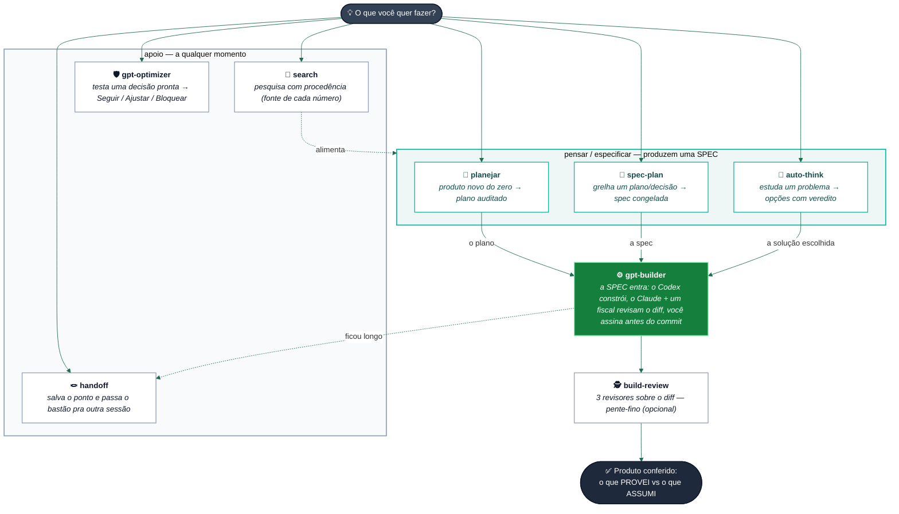

# Titan — pensar, fazer e passar o bastão

Sete skills de desenvolvimento, chamáveis individualmente — repo-agnóstico, serve pra qualquer
projeto: planejar um produto novo, estudar um problema a fundo, executar uma tarefa com crítico,
refletir sobre uma decisão antes de cravar, e passar o bastão entre sessões.

**Autoria:** Cassiano Diniz · **Co-autoria:** Thales Laray

## Instalar

**1. O plugin** — no Claude Code, uma linha por vez:

```
/plugin marketplace add cassianodiniz/cassiano.diniz
/plugin install Titan@cassiano.diniz
```

**2. Os requisitos** — as ferramentas externas que algumas skills usam. Um comando no terminal
instala o que dá automático (Mac/Linux; Windows via Git Bash):

```bash
curl -fsSL https://raw.githubusercontent.com/cassianodiniz/Titan/main/install.sh | SKIP_PLUGIN=1 bash
```

Ele instala: o **Codex CLI** (o crítico que confronta as decisões), os plugins **superpowers**
(brainstorm + escrever o plano) e **cloudflare**, e as skills **taste-skill** (design de tela),
**find-skills** e **gemini-api-dev** (mockups). Fica manual só o que depende de conta/chave sua:
**`codex login`**, a **GEMINI_API_KEY** (mockups, grátis em aistudio.google.com/apikey) e — se você
usar — a **/pesquisa + Perplexity** (a pesquisa web da planejar). Detalhe item a item no
**[INSTALL.md](INSTALL.md)**. Depois, **reinicie o Claude Code**.

> Nenhum requisito trava o plugin: o que faltar, a skill degrada com aviso e segue.

## O que faz

| Comando | O que faz |
|---|---|
| `/Titan:planejar <ideia>` | Desenha um produto/software novo do zero antes de codar (8 fases: brainstorm → escopo → design → plano auditado). No fim, oferece executar com a gpt-builder. |
| `/Titan:spec-plan <ideia>` | Grelha um plano/decisão/ideia até o entendimento comum e escreve uma **spec congelada** pra construir com IA. No fim, oferece mandar pra `/gpt-builder` construir. |
| `/Titan:auto-think <problema>` | Estuda a fundo um problema **sem resposta**: ataca de vários ângulos em paralelo, confronta com o Codex/GPT em 2 rodadas, e entrega **opções com veredito**. Gera caminhos — não executa. |
| `/Titan:gpt-builder <spec>` | Entrega uma **spec congelada** (ex.: `PLAN.md`) pro **Codex construir** com acesso total; o **Claude revisa o diff** inteiro como um PR, um **fiscal independente** prova cada item, e **você assina** antes de qualquer commit. Sem spec? Ela manda pra `/spec-plan` primeiro. |
| `/Titan:search <pergunta>` | Pesquisa profunda via **Exa** com procedência: cada número volta com a página, a frase e a data em que foi lido. Precisa de conta Exa. |
| `/Titan:build-review` | Junta **3 revisores independentes** sobre um diff já construído — padrões da casa, aderência à spec, e um fiscal que prova cada item da checklist. Roda **depois da `gpt-builder`**, como pente-fino. |
| `/Titan:gpt-optimizer` | Segunda opinião adversarial pra **refletir sobre uma decisão que você JÁ tem** antes de cravar: o Codex (GPT-5.6) tenta derrubar e devolve veredito **Seguir / Ajustar / Bloquear**. |
| `/Titan:handoff` | Gera um documento de passagem de bastão pra continuar o trabalho numa sessão nova, do zero. |

**Como se encaixam:** `planejar`, `spec-plan` e `auto-think` são os pensadores (uma desenha um
produto novo, outra grelha um plano até virar spec, a terceira estuda um problema aberto) e
entregam a spec pra `gpt-builder` construir. `search` alimenta qualquer um deles com pesquisa de
procedência. `gpt-optimizer` é o confronto avulso — fora do ciclo, testa uma decisão pronta a
qualquer momento. `handoff` salva o ponto e passa pra próxima sessão.

## Qual eu uso? — guia rápido pra quem tá começando

Se os nomes ainda não dizem nada, comece pela **sua situação**. Ache a linha que
descreve o seu momento e use o comando da direita:

| Quando você... | Use | O que ganha no fim |
|---|---|---|
| tem uma **ideia de app/produto** e quer construir do zero | `/planejar` | um plano detalhado, já revisado, pronto pra executar |
| tem um **plano/decisão** e quer virar uma spec sólida pra construir com IA | `/spec-plan` | uma spec congelada, grelhada até o entendimento comum |
| tem um **problema difícil sem resposta pronta** e quer enxergar as saídas | `/auto-think` | 2–3 caminhos possíveis, com a recomendação e o porquê de cada um |
| tem uma **spec pronta** e quer que ela seja construída e conferida | `/gpt-builder` | o trabalho pronto: o **Codex constrói** a spec, o **Claude + um fiscal revisam** antes de fechar |
| precisa de **pesquisa confiável** (dados, mercado, papers) com fonte de cada número | `/search` | achados com procedência: página, frase e data de cada número |
| **já decidiu algo** e quer testar se a decisão aguenta antes de cravar | `/gpt-optimizer` | um veredito claro: **Seguir**, **Ajustar** ou **Bloquear** |
| vai **fechar a sessão** e quer continuar depois sem perder o fio | `/handoff` | um documento que a próxima sessão lê pra retomar do ponto exato |

> Regra de bolso: **pensar** algo → `planejar` (produto novo), `spec-plan` (virar spec) ou `auto-think` (problema aberto).
> **Pesquisar** com fonte → `search`. **Fazer** algo → `gpt-builder` (o Codex constrói, o Claude revisa).
> **Conferir** uma decisão pronta → `gpt-optimizer`. **Continuar depois** → `handoff`.

### Por dentro: o que cada um faz, passo a passo

O detalhe completo está no fluxograma abaixo. Em uma linha, o caminho de cada comando:

| Comando | Como funciona por dentro |
|---|---|
| `/planejar` | brainstorm da ideia → pesquisa (como já resolveram + qual stack) → design e mockups → escreve o plano → **Codex (GPT) audita** → corrige → entrega o plano final |
| `/spec-plan` | **Fase 1 investiga** (grelha até o entendimento comum, sem chutar) → **Fase 2 escreve a spec** (problema, cenários de comportamento, decisões) → oferece mandar pra `/gpt-builder` construir |
| `/auto-think` | **formula o problema** → estuda vários ângulos em paralelo (puxa a doc oficial quando é de uma tecnologia) → **Codex/GPT tenta derrubar** cada saída → re-cava o que ficou aberto → escolhe entre as que sobraram → entrega as opções com veredito |
| `/gpt-builder` | portão (spec + árvore limpa + checklist) → o **Codex constrói** a partir da spec congelada → o **Claude lê o diff inteiro** e roda a prova + um **fiscal independente** prova cada item no HEAD → fix-loop limitado → **você assina** antes do commit |
| `/search` | planeja a busca → dispara subagentes no Exa → **checa os relatórios** antes de confiar → compila com procedência (página, frase, data por número) → arquiva em `search-findings/` |
| `/gpt-optimizer` | monta o alvo (a sua decisão) → **Codex tenta derrubar** → você filtra com prova o que não procede → **Codex audita o seu filtro** → veredito **Seguir / Ajustar / Bloquear** |
| `/handoff` | ancora no git (branch, commit, o que mudou) → captura o estado e os ponteiros (fato vs suposição) → salva o documento e abre na tela |

## Fluxograma

As portas e o ciclo (detalhe em [FLUXOGRAMA.md](FLUXOGRAMA.md)):


```mermaid
%%{init: {'theme':'base', 'themeVariables': {
  'fontSize':'15px',
  'fontFamily':'Helvetica, Arial, sans-serif',
  'lineColor':'#1f6b4f',
  'edgeLabelBackground':'#ffffff'
}}}%%
flowchart TD
    START(["💡 O que você quer fazer?"])

    subgraph PENSAR["pensar / especificar — produzem uma SPEC"]
        direction TB
        P["<b>🧠 planejar</b><br/><i>produto novo do zero → plano auditado</i>"]
        SP["<b>📝 spec-plan</b><br/><i>grelha um plano/decisão → spec congelada</i>"]
        AT["<b>🔬 auto-think</b><br/><i>estuda um problema → opções com veredito</i>"]
    end

    GB["<b>⚙️ gpt-builder</b><br/><i>a SPEC entra: o Codex constrói, o Claude + um fiscal revisam o diff, você assina antes do commit</i>"]

    subgraph APOIO["apoio — a qualquer momento"]
        direction TB
        SE["<b>🔎 search</b><br/><i>pesquisa com procedência (fonte de cada número)</i>"]
        GO["<b>🛡️ gpt-optimizer</b><br/><i>testa uma decisão pronta → Seguir / Ajustar / Bloquear</i>"]
        HO["<b>🪢 handoff</b><br/><i>salva o ponto e passa o bastão pra outra sessão</i>"]
    end

    START --> P & SP & AT
    START --> SE & GO & HO
    P -->|"o plano"| GB
    SP -->|"a spec"| GB
    AT -->|"a solução escolhida"| GB
    GB --> BR["<b>🕵️ build-review</b><br/><i>3 revisores sobre o diff — pente-fino (opcional)</i>"]
    BR --> DONE(["✅ Produto conferido:<br/>o que PROVEI vs o que ASSUMI"])
    GB -. "ficou longo" .-> HO
    SE -. "alimenta" .-> PENSAR

    classDef think fill:#ffffff,color:#134e4a,stroke:#14b8a6,stroke-width:1.5px;
    classDef build fill:#15803d,color:#ffffff,stroke:#86efac,stroke-width:1.5px;
    classDef help fill:#ffffff,color:#0f172a,stroke:#94a3b8,stroke-width:1.5px;
    classDef start fill:#334155,color:#ffffff,stroke:#0f172a,stroke-width:1.5px;
    classDef fim fill:#1e293b,color:#ffffff,stroke:#0f172a,stroke-width:1.5px;
    class P,SP,AT think;
    class GB build;
    class SE,GO,HO,BR help;
    class START start;
    class DONE fim;
    style PENSAR fill:#eef7f5,stroke:#14b8a6,stroke-width:2px;
    style APOIO fill:#f8fafc,stroke:#94a3b8,stroke-width:2px;
```
